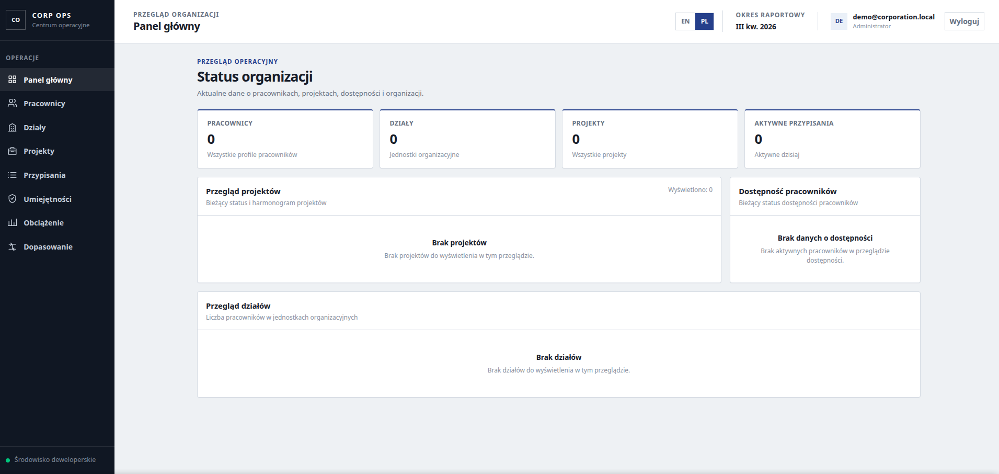
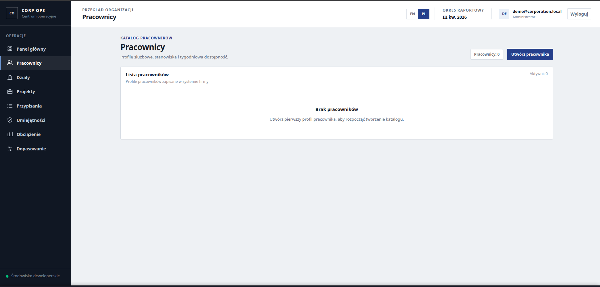
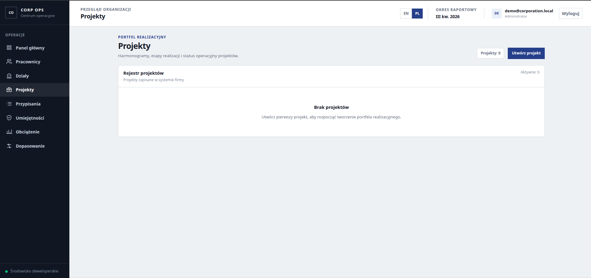
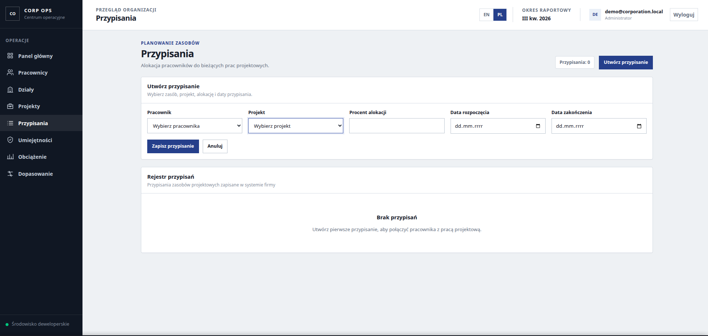
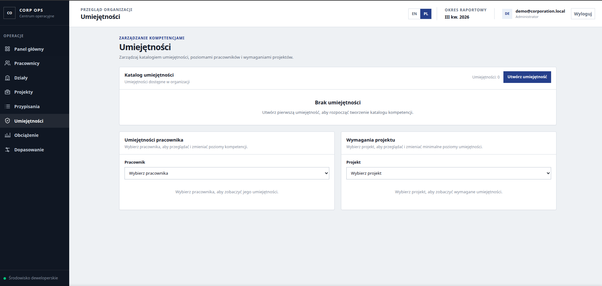
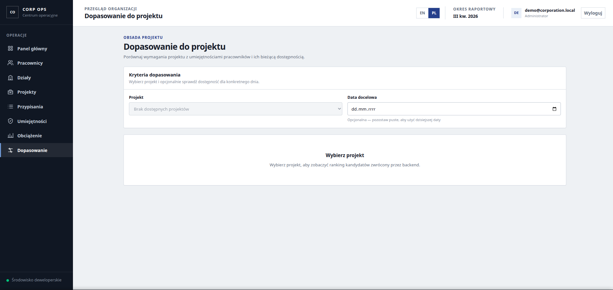
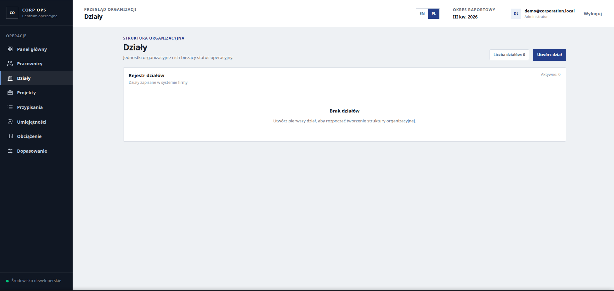
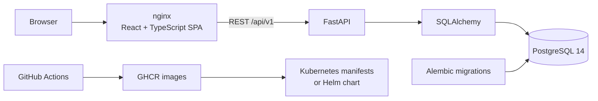

# Corporation Resource Management

Corporation Resource Management is a full-stack workforce planning application for organizing employees, departments, projects, assignments, skills, and capacity in one operational workspace. It models the decisions behind project staffing: who is available, which skills a project requires, and why one employee is a better match than another.

The project combines a React interface with a FastAPI REST API and PostgreSQL. It also demonstrates a complete delivery path through Docker Compose, GitHub Actions, container images, plain Kubernetes manifests, a Helm chart, and a Terraform-managed Helm release.



## Highlights

- **Authentication and authorization:** JWT authentication with `ADMIN`, `MANAGER`, and `EMPLOYEE` roles; administrative user management is protected by the existing RBAC flow.
- **Organization management:** employee profiles, departments, department membership, projects, and date-bounded assignments.
- **Resource planning:** allocation percentages and date-aware capacity calculations identify available, fully allocated, and over-allocated employees.
- **Skills and matching:** employee skill levels and project requirements feed a deterministic ranking that explains met and unmet requirements alongside current capacity.
- **Operational interface:** an API-backed dashboard, dedicated management views, an administrator console, and English/Polish localization.
- **Delivery and quality:** automated migrations, health-aware startup, backend and frontend test suites, static analysis, container builds, and infrastructure validation in CI.

## Demo account

The Docker Compose workflow automatically provisions an idempotent local administrator after the database migrations finish.

| | Local demo credential |
| --- | --- |
| Email | `demo@corporation.local` |
| Password | `Demo123!` |

The login page displays these credentials and includes a **Use demo account** button that fills the form without submitting it. This account is intentionally public and is only for the local portfolio database. It is not used by Kubernetes, Helm, Terraform, CI, or any production environment.

## Application preview

<table>
  <tr>
    <td width="50%"><strong>Employees</strong><br></td>
    <td width="50%"><strong>Projects</strong><br></td>
  </tr>
  <tr>
    <td width="50%"><strong>Assignments</strong><br></td>
    <td width="50%"><strong>Skills</strong><br></td>
  </tr>
  <tr>
    <td width="50%"><strong>Project matching</strong><br></td>
    <td width="50%"><strong>Departments</strong><br></td>
  </tr>
</table>

## Architecture



The browser calls relative `/api/v1` URLs. In the production frontend image, nginx serves the compiled SPA, falls back to `index.html` for client-side routes, and proxies `/api` requests to FastAPI. SQLAlchemy owns database access, while Alembic migrations run as a separate deployment step before normal application use.

Docker Compose builds both application images and orchestrates PostgreSQL, migrations, local demo-user provisioning, the API, and the frontend. GitHub Actions validates the code and infrastructure, then publishes backend and frontend images to GHCR on successful pushes to `main`. Plain Kubernetes manifests and the Helm chart provide two deployment representations of the same application.

## Technology stack

| Area | Technologies |
| --- | --- |
| Backend | Python 3.12, FastAPI, SQLAlchemy 2, Pydantic, Alembic, PyJWT, pwdlib/Argon2 |
| Frontend | React 19, TypeScript, Vite, React Router, SCSS, nginx |
| Database | PostgreSQL 14 |
| Testing | Pytest, Vitest, React Testing Library, jsdom |
| Code quality | Ruff, Oxlint, TypeScript compiler |
| Containers and CI | Docker, Docker Compose, GitHub Actions, GHCR |
| Infrastructure | Kubernetes, kubeconform, Helm, Terraform Helm provider |

## Repository structure

```text
.
├── backend/                  # FastAPI API, domain models, services, migrations, tests
│   ├── alembic/              # Versioned database migrations
│   ├── app/                  # API, schemas, models, security, and domain services
│   ├── scripts/              # Interactive and local-demo administrator bootstrap
│   └── tests/
├── frontend/                 # React SPA, tests, styles, and nginx image
├── docs/screenshots/         # Application screenshots used in this README
├── infrastructure/
│   ├── kubernetes/           # Plain Kubernetes resources
│   ├── helm/                 # Parameterized application chart
│   └── terraform/            # Helm-release IaC example
├── .github/workflows/        # Quality checks and container publishing
└── docker-compose.yml
```

## Quick start with Docker Compose

Docker Compose is the primary local evaluation path. Docker Engine with the Compose plugin is required.

1. Create the local environment file:

   ```bash
   cp .env.example .env
   ```

2. Replace the development placeholders in `.env`. `POSTGRES_PASSWORD` and the password embedded in `DATABASE_URL` must match. If the password contains URL-sensitive characters, URL-encode it inside `DATABASE_URL`. Keep `db` as the database host for containers.

3. Build and start the application:

   ```bash
   docker compose up --build
   ```

4. Open:

   - application: <http://localhost:8080>
   - FastAPI documentation: <http://localhost:8000/docs>

During startup, Compose:

1. starts PostgreSQL and waits for its health check;
2. applies all Alembic migrations;
3. creates or repairs the local demo administrator idempotently;
4. starts FastAPI after migrations and demo provisioning succeed;
5. serves the compiled frontend through nginx.

Use the [demo account](#demo-account) to explore the full application, including the Admin Console. To create an additional administrator interactively:

```bash
docker compose exec backend python -m scripts.create_admin
```

Stop the stack without deleting its database:

```bash
docker compose down
```

`docker compose down -v` also deletes the PostgreSQL volume and all local application data. Use it only when a clean database is intentional.

## Development setup

Native development is secondary to the Compose workflow and requires Python 3.12, Node.js (CI uses Node.js 22), and a reachable PostgreSQL database.

For the backend, set `DATABASE_URL` to the development database and provide a development-only `JWT_SECRET_KEY`, then run:

```bash
cd backend
python -m venv .venv
source .venv/bin/activate
python -m pip install -r requirements.txt
alembic upgrade head
uvicorn app.main:app --reload
```

For the frontend:

```bash
cd frontend
npm ci
npm run dev
```

The Vite server proxies `/api` to `http://localhost:8000`. Automatic demo-user provisioning is intentionally part of Docker Compose only; native development can use the interactive administrator script.

## Testing and quality

Backend checks, run from `backend/` with `DATABASE_URL` and `JWT_SECRET_KEY` configured:

```bash
python -m pytest
ruff check app scripts tests
alembic upgrade head
alembic check
```

Frontend checks, run from `frontend/`:

```bash
npm test -- --run
npm run lint
npm run typecheck
npm run build
```

Infrastructure checks from the repository root:

```bash
docker compose --env-file .env.example config --quiet

docker run --rm -v "$PWD":/work -w /work \
  ghcr.io/yannh/kubeconform:v0.8.0 \
  -strict -summary -kubernetes-version 1.34.0 infrastructure/kubernetes

helm lint infrastructure/helm
helm template portfolio infrastructure/helm >/dev/null

terraform -chdir=infrastructure/terraform init -backend=false -input=false
terraform -chdir=infrastructure/terraform fmt -check
terraform -chdir=infrastructure/terraform validate
```

The backend suite covers authentication, RBAC, administrators, employees, departments, projects, assignments, capacity, skills, matching, and schema behavior. Frontend tests cover services, authorization routing, session behavior, and the main application views.

## CI/CD

`.github/workflows/docker-publish.yml` runs on pull requests to `main` and pushes to `main`:

- **Backend quality:** starts an ephemeral PostgreSQL 14 service, runs Ruff, upgrades and checks Alembic migrations, and executes Pytest.
- **Frontend quality:** installs locked dependencies, runs Oxlint, Vitest, TypeScript checks, and the production build.
- **Infrastructure quality:** validates Docker Compose, checks plain manifests offline with kubeconform, lints and renders Helm, and initializes, formats, and validates Terraform.
- **Container delivery:** builds backend and frontend images after all quality jobs pass. Pull requests build without publishing; successful pushes to `main` publish `latest` and commit-SHA tags using `GITHUB_TOKEN`.

Published image names:

- `ghcr.io/marpot/corporation_simulation_project`
- `ghcr.io/marpot/corporation_simulation_project-frontend`

## Kubernetes

The plain manifests are suitable for a local kind demonstration and as readable deployment documentation; they are not a claim of a public production deployment. They define PostgreSQL persistence, Services, backend and frontend Deployments, health probes, resource requests/limits, an Alembic Job, and an optional nginx Ingress.

The manifests expect these pre-created Secrets:

- `postgres-secret`: `POSTGRES_USER`, `POSTGRES_PASSWORD`, `POSTGRES_DB`, and a matching URL-encoded `DATABASE_URL` using host `db`;
- `backend-secret`: `JWT_SECRET_KEY`;
- `ghcr-credentials`: registry credentials when the GHCR images are private.

Before changing anything, select and verify the intended context explicitly:

```bash
kubectl config use-context kind-corporation-sim
kubectl config current-context
```

Create local Secrets without committing their values:

```bash
kubectl create secret generic postgres-secret \
  --from-env-file=infrastructure/kubernetes/.env
kubectl create secret generic backend-secret \
  --from-literal=JWT_SECRET_KEY="$(openssl rand -hex 32)"
kubectl create secret docker-registry ghcr-credentials \
  --docker-server=ghcr.io \
  --docker-username="YOUR_GITHUB_USER" \
  --docker-password="YOUR_GITHUB_TOKEN"
```

Deploy in dependency order:

```bash
kubectl apply -f infrastructure/kubernetes/postgres-pvc.yaml \
  -f infrastructure/kubernetes/postgres-service.yaml \
  -f infrastructure/kubernetes/postgres-deployment.yaml
kubectl rollout status deployment/db --timeout=12m

kubectl delete job backend-migrations --ignore-not-found
kubectl apply -f infrastructure/kubernetes/backend-migrations-job.yaml
kubectl wait --for=condition=complete job/backend-migrations --timeout=12m

kubectl apply -f infrastructure/kubernetes/backend-service.yaml \
  -f infrastructure/kubernetes/backend-deployment.yaml \
  -f infrastructure/kubernetes/frontend-service.yaml \
  -f infrastructure/kubernetes/frontend-deployment.yaml
kubectl rollout status deployment/backend --timeout=12m
kubectl rollout status deployment/frontend --timeout=12m
```

Without an Ingress controller, access the complete application through the frontend Service:

```bash
kubectl port-forward service/frontend 8080:80
```

The optional Ingress uses host `corporation-sim.local` and class `nginx`. Kubernetes does not provision the public demo administrator. Create an environment-specific administrator interactively if required:

```bash
kubectl exec -it deployment/backend -- python -m scripts.create_admin
```

## Helm

`infrastructure/helm` packages the same PostgreSQL, migration, backend, frontend, persistence, probe, resource, Service, and optional Ingress configuration. Values expose image repositories and tags, replicas, Services, storage, resources, Ingress, image-pull Secrets, and existing application Secret names. The chart references Secrets; it does not create or embed credentials.

```bash
helm lint infrastructure/helm
helm template portfolio infrastructure/helm
helm upgrade --install portfolio infrastructure/helm \
  --namespace corporation-sim --create-namespace --wait --timeout 15m
```

Create the expected Secrets in the target namespace before installation. Alembic runs as a post-install/post-upgrade Helm hook.

## Terraform

`infrastructure/terraform` is an Infrastructure as Code example that manages the local Helm chart through an explicitly selected Kubernetes context. It does **not** provision a cluster, network, database service, or other cloud infrastructure.

```bash
terraform -chdir=infrastructure/terraform init -backend=false
terraform -chdir=infrastructure/terraform fmt -check
terraform -chdir=infrastructure/terraform validate
```

The default context is `kind-corporation-sim`, which reduces the risk of targeting another cluster accidentally. Run `terraform plan` or `terraform apply` only after verifying the selected context and creating the referenced Kubernetes Secrets. Secret values remain outside Terraform configuration and state.

## Security and secrets

- `.env`, `.env.*`, `infrastructure/kubernetes/.env`, Terraform state, provider caches, and common credential artifacts are ignored; `.env.example` is the committed template.
- Passwords are hashed through the existing password security layer. JWT signing and database credentials come from environment variables or Kubernetes Secret references.
- Plain manifests, Helm values, and Terraform variables reference Secret names rather than embedding Secret values.
- CI uses a run-specific disposable PostgreSQL password and `GITHUB_TOKEN` for authorized GHCR publication.
- The public demo credentials are intentionally limited to the local Docker Compose portfolio workflow and must not be reused elsewhere.

## Engineering decisions

- The SPA, API, persistence, and migration responsibilities are separated into independently testable components.
- Schema changes are versioned and migrations are treated as a deployment step rather than application startup side effects.
- Compose dependency conditions and Kubernetes startup/readiness/liveness probes account for database initialization and recovery time.
- Authorization is enforced in the API through role dependencies; the demo account receives the existing `ADMIN` role instead of bypassing RBAC.
- Capacity is derived from date-bounded assignment percentages instead of maintained as duplicated state.
- Matching is deterministic and exposes skill-level explanations and available capacity rather than returning an opaque score.
- CI exercises application tests, static analysis, builds, migration consistency, and offline infrastructure validation before image publication.
- Kubernetes is represented both as readable manifests and as a parameterized Helm chart; Terraform demonstrates controlled Helm release management without claiming cloud provisioning.
