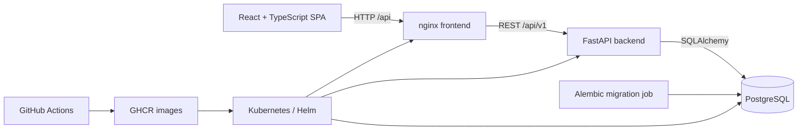

# Corporation Resource Management

A full-stack portfolio application for planning people, skills, capacity, and
project staffing. It models a small company’s real resource-allocation workflow
without introducing unrelated platform complexity.

## What the application does

- JWT authentication and role-based access for `ADMIN`, `MANAGER`, and
  `EMPLOYEE` users
- employee and department management, including department membership
- project management and time-bounded employee assignments
- allocation percentages, capacity calculation, and over-allocation detection
- an employee skill catalog and project skill requirements
- deterministic, explainable employee-to-project matching based on skills and
  available capacity
- an API-backed dashboard and a separate administration console
- English and Polish frontend translations

## Architecture



The frontend uses relative `/api/v1` URLs. In containers, nginx serves the SPA,
supports client-side route fallback, and proxies `/api` to the backend Service.
The backend is synchronous FastAPI with SQLAlchemy and PostgreSQL. Alembic owns
schema evolution.

## Technology

| Area | Stack |
| --- | --- |
| Backend | Python 3.12, FastAPI, SQLAlchemy, Pydantic, Alembic, PyJWT |
| Frontend | React 19, TypeScript, Vite, React Router, SCSS |
| Database | PostgreSQL 14 |
| Testing | Pytest, Vitest, React Testing Library |
| Quality | Ruff, Oxlint, TypeScript |
| Delivery | Docker, Docker Compose, GitHub Actions, GHCR |
| Infrastructure | Kubernetes, Helm, Terraform |

## Repository layout

```text
.
├── backend/                  # FastAPI application, migrations, tests, admin bootstrap
├── frontend/                 # React application and nginx production image
├── infrastructure/
│   ├── kubernetes/           # Plain Kubernetes resources
│   ├── helm/                 # Parameterized application chart
│   └── terraform/            # Helm-release IaC example
├── .github/workflows/        # CI and image publishing
└── docker-compose.yml
```

## Local development

Backend dependencies require Python 3.12. Frontend dependencies require a
current Node.js release (CI uses Node.js 22).

```bash
cp .env.example .env
# Replace development placeholders in .env.

cd backend
python -m venv .venv
source .venv/bin/activate
pip install -r requirements.txt
alembic upgrade head
uvicorn app.main:app --reload
```

In a second terminal:

```bash
cd frontend
npm ci
npm run dev
```

The Vite development server proxies `/api` to `http://localhost:8000`.
FastAPI documentation is available at `http://localhost:8000/docs`.

## Docker Compose

```bash
cp .env.example .env
# Set a real database password and matching DATABASE_URL in .env.
docker compose up --build
```

Compose starts PostgreSQL, runs `alembic upgrade head`, starts FastAPI, and
serves the frontend at `http://localhost:8080`. The backend remains available
at `http://localhost:8000` for API development.

Create the first administrator interactively after the database is ready:

```bash
docker compose exec backend python -m scripts.create_admin
```

Stop the stack with `docker compose down`. Add `--volumes` only when you
intentionally want to delete local PostgreSQL data.

## Kubernetes demo

The plain manifests use the current namespace and expect three pre-created
Secrets:

- `postgres-secret`: `POSTGRES_USER`, `POSTGRES_PASSWORD`, `POSTGRES_DB`, and a
  matching URL-encoded `DATABASE_URL` whose host is `db`
- `backend-secret`: `JWT_SECRET_KEY`
- `ghcr-credentials`: a Docker registry pull Secret for private GHCR images

Secret values and local `.env` files are not stored in Git.

For the local kind demo, first confirm the protected context explicitly:

```bash
kubectl config use-context kind-corporation-sim
kubectl config current-context
```

Create local Secrets without adding values to YAML:

```bash
kubectl create secret generic postgres-secret \
  --from-env-file=infrastructure/kubernetes/.env
kubectl create secret generic backend-secret \
  --from-literal=JWT_SECRET_KEY="$(openssl rand -hex 32)"
kubectl create secret docker-registry ghcr-credentials \
  --docker-server=ghcr.io \
  --docker-username="YOUR_GITHUB_USER" \
  --docker-password="YOUR_GITHUB_TOKEN"
```

Deploy in dependency order:

```bash
kubectl apply -f infrastructure/kubernetes/postgres-pvc.yaml \
  -f infrastructure/kubernetes/postgres-service.yaml \
  -f infrastructure/kubernetes/postgres-deployment.yaml
kubectl rollout status deployment/db

kubectl delete job backend-migrations --ignore-not-found
kubectl apply -f infrastructure/kubernetes/backend-migrations-job.yaml
kubectl wait --for=condition=complete job/backend-migrations --timeout=180s

kubectl apply -f infrastructure/kubernetes/backend-service.yaml \
  -f infrastructure/kubernetes/backend-deployment.yaml \
  -f infrastructure/kubernetes/frontend-service.yaml \
  -f infrastructure/kubernetes/frontend-deployment.yaml
kubectl rollout status deployment/backend
kubectl rollout status deployment/frontend
```

The Ingress manifest uses the host `corporation-sim.local` and class `nginx`.
Apply it only when an nginx Ingress controller is installed:

```bash
kubectl apply -f infrastructure/kubernetes/ingress.yaml
```

Without an Ingress controller, access the complete application through the
frontend Service:

```bash
kubectl port-forward service/frontend 8080:80
```

Then open `http://localhost:8080`. Create the first administrator with:

```bash
kubectl exec -it deployment/backend -- python -m scripts.create_admin
```

PostgreSQL data is stored in the `postgres-data` PVC. The workloads include
health probes and conservative resource requests and limits.

## Helm

The chart at `infrastructure/helm` represents the same backend, frontend,
PostgreSQL, persistence, migrations, probes, and optional Ingress setup.
Meaningful values cover images, replicas, Services, resources, storage,
Ingress, and existing Secret names.

```bash
helm lint infrastructure/helm
helm template portfolio infrastructure/helm
helm upgrade --install portfolio infrastructure/helm \
  --namespace corporation-sim --create-namespace --wait
```

Create the required Secrets in the target namespace before installation. The
chart never creates or embeds credentials. Its Alembic Job runs as a
post-install/post-upgrade hook.

## Terraform example

`infrastructure/terraform` demonstrates Infrastructure as Code by managing the
local Helm chart through an explicitly selected Kubernetes context. It creates
no cloud resources and requires no cloud credentials.

```bash
cd infrastructure/terraform
terraform init -backend=false
terraform fmt -check
terraform validate
terraform plan
```

The default context is fixed to `kind-corporation-sim`. No `terraform apply` is
needed for repository validation. Existing Secret values stay outside
Terraform state.

## Tests and quality checks

Run the backend checks from `backend/`:

```bash
python -m pytest
ruff check app scripts tests
DATABASE_URL=postgresql://... alembic upgrade head
DATABASE_URL=postgresql://... alembic check
```

Run the frontend checks from `frontend/`:

```bash
npm test -- --run
npm run lint
npm run typecheck
npm run build
```

Latest verified results for this repository state:

- backend: 185 tests passed; Ruff passed
- frontend: 108 tests passed across 18 files; Oxlint and TypeScript passed;
  production build passed
- Alembic: all migrations applied to PostgreSQL and schema check passed
- Docker: backend and frontend images built; Compose configuration passed
- Kubernetes: server-side manifest validation passed; frontend `200` and a
  database-backed invalid-login `401` verified through the frontend Service
- Helm: lint, template, install, and the same live HTTP path passed
- Terraform: formatting check and validation passed

## CI/CD

GitHub Actions runs backend tests, Ruff, Alembic validation against an ephemeral
PostgreSQL service, frontend tests, Oxlint, TypeScript, the production build,
Docker Compose validation, Kubernetes client validation, Helm lint/template,
and Terraform format/validation. Pull requests need no production credentials.

On pushes to `main`, successful checks publish SHA and `latest` images to GHCR:

- `ghcr.io/marpot/corporation_simulation_project`
- `ghcr.io/marpot/corporation_simulation_project-frontend`

## Security and secrets

- `.env`, `.env.*`, Kubernetes local environment files, Terraform state, and
  common credential/build artifacts are ignored.
- committed manifests and Helm values contain only Secret references.
- JWT and database credentials have no production defaults in Kubernetes.
- GitHub Actions uses an ephemeral CI database credential and `GITHUB_TOKEN`
  only for image publication on pushes.
- no Kubernetes Secret values or Terraform state belong in version control.
